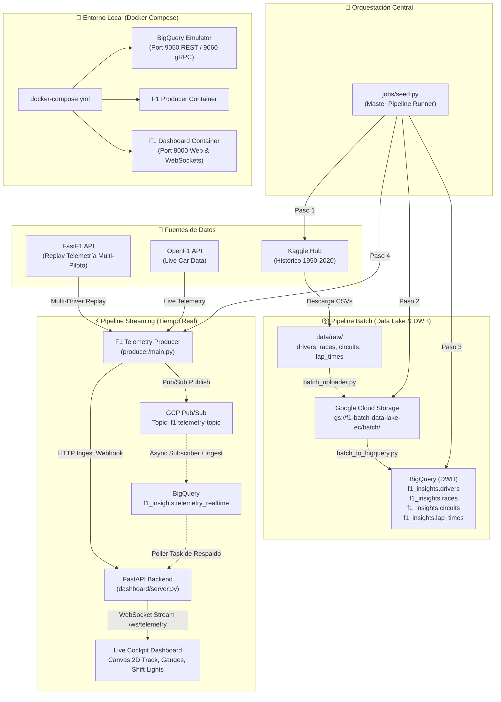

# 🏎️ F1 Telemetry Real-Time & Batch Pipeline

Pipeline de datos end-to-end de alta disponibilidad para la ingesta, procesamiento, almacenamiento y visualización de telemetría de **Fórmula 1**, combinando procesamiento **Batch** (Kaggle Data Lake -> GCS -> BigQuery) y **Streaming en tiempo real** (FastF1 / OpenF1 -> Pub/Sub & Webhook Ingestion -> FastAPI / WebSockets Cockpit Dashboard & BigQuery).

---

## 🏛️ Arquitectura del Sistema



---

## 📂 Estructura del Proyecto

```text
f1-telemetry-pipeline/
├── config/
│   └── settings.py              # Centralización de configuración y variables de entorno
├── dashboard/
│   ├── server.py                # Servidor FastAPI, WebSocket Hub y BigQuery Poller
│   └── static/                  # Frontend Cockpit F1 Dark (Canvas 2D, Gauges, Leaderboard)
│       ├── app.js               # Conexión WebSocket, normalización de pista y animaciones
│       ├── index.html           # Interfaz Cockpit en tiempo real
│       └── style.css            # Estilos F1 Dark Cockpit y colores por escudería
├── data/
│   ├── batch_uploader.py        # Ingesta Kaggle -> Local -> GCS
│   ├── batch_to_bigquery.py     # ETL Batch GCS -> BigQuery con limpieza y tipado
│   └── raw/                     # Almacenamiento local de CSVs y caché de FastF1
├── docker/
│   ├── dashboard.Dockerfile     # Imagen Docker para el Dashboard Cockpit
│   └── producer.Dockerfile      # Imagen Docker para el productor/orquestador
├── jobs/
│   └── seed.py                  # Orquestador maestro del pipeline completo
├── producer/
│   ├── main.py                  # Productor de telemetría multi-piloto y multi-escudería
│   └── requirements.txt         # Dependencias específicas del productor
├── docker-compose.yml           # Stack local con emulador de BigQuery, productor y dashboard
├── install.bat                  # Script de instalación y entorno virtual para Windows
├── requirements.txt             # Dependencias completas del proyecto
└── README.md                    # Documentación técnica de la arquitectura
```

---

## 🚀 Componentes Principales

### 1. Orquestador Maestro (`jobs/seed.py`)
Automatiza y encadena de manera secuencial las fases del pipeline con una sola instrucción:

```powershell
python jobs/seed.py
```

- **Paso 1 (Ingesta Batch Kaggle)**: Descarga el dataset histórico de Formula 1 mediante `kagglehub` y estructura los archivos clave (`drivers.csv`, `races.csv`, `circuits.csv`, `lap_times.csv`) en `data/raw/`.
- **Paso 2 (Data Lake GCS)**: Sube los archivos limpios al bucket `gs://<GCS_BUCKET_NAME>/batch/`.
- **Paso 3 (ETL Batch a BigQuery)**: Procesa valores nulos (`\N`), convierte fechas (`dob`, `date`), números enteros (`number`, `alt`, `milliseconds`) y consolida las tablas en el dataset `f1_insights` de BigQuery con disposición `WRITE_TRUNCATE`.
- **Paso 4 (Streaming en Tiempo Real & Sincronización de Caché)**: 
  - Sincroniza la caché de FastF1 con GCS (`sync_fastf1_cache`) para evitar bloqueos HTTP 403 por límites de la CDN en entornos cloud.
  - Carga la carrera configurada (ej. Monza 2023), detecta automáticamente a **todos los pilotos de todas las escuderías** (Ferrari, Red Bull, Mercedes, McLaren, Aston Martin, Alpine, etc.), sincroniza sus telemetrías cronológicamente e inicia la transmisión en tiempo real.

### 2. Productor de Telemetría (`producer/main.py`)
- **Modo Replay**: Extrae la telemetría de vueltas desde FastF1 e intercala las lecturas de velocidad (`speed_kmh`), revoluciones (`rpm`), marcha (`gear`), acelerador (`throttle`), freno (`brake`) y coordenadas del monoplaza (`x_pos`, `y_pos`) en estricto orden cronológico (`timestamp`).
- **Modo Live**: Consume lecturas de telemetría en vivo desde la API de OpenF1.
- **Distribución Dual**:
  - Publica los eventos en **GCP Pub/Sub** (`PUB_SUB_TOPIC`).
  - Envía copia directa mediante webhook HTTP (`DASHBOARD_INGEST_URL`) a la API de ingestión del dashboard para visualización instantánea.
- **Fallback de Alta Disponibilidad**: Si FastF1 o la CDN se encuentran bloqueados o inaccesibles, activa un generador continuo con la trayectoria geométrica y dinámica de Monza calculando curvas, rectas y zonas de frenada para todos los monoplazas.
- **Soporte Dry-Run & Concurrencia**: Permite validar la emisión sin conexión a GCP (`--dry-run`) o distribuir la emisión en hilos concurrentes (`--concurrent`).

### 3. Dashboard en Tiempo Real (`dashboard/`)
- **Backend FastAPI & WebSockets (`dashboard/server.py`)**:
  - **Webhook `/api/telemetry/ingest`**: Recibe eventos de telemetría del productor y los enriquece al vuelo con metadatos de escudería, código de piloto y colores oficiales.
  - **WebSocket `/ws/telemetry`**: Emite las métricas enriquecidas a los navegadores en tiempo real con latencia de subsegundo.
  - **BigQuery Poller de Respaldo**: Consulta periódicamente los últimos eventos de `f1_insights.telemetry_realtime` para asegurar visualización continua cuando no hay streaming activo en vivo.
  - **REST API**: Proporciona endpoints de salud (`/api/health`) y catálogo de pilotos (`/api/drivers`).
- **Frontend F1 Dark Cockpit (`dashboard/static/`)**:
  - **Mapa 2D de Pista Interactivo (Canvas)**: Renderiza las coordenadas X/Y de todos los monoplazas en pista con colores oficiales de cada escudería y glow distintivo en el piloto seleccionado.
  - **Tacómetro & Shift Lights**: Luces LED de cambio progresivas (verdes, rojas, púrpuras) sincronizadas hasta 12,500 RPM.
  - **Velocímetro & Indicador de Marcha**: Display digital de velocidad (0–360 km/h) e indicador de marcha engranada (1–8 / N / R).
  - **Pedales de Telemetría**: Barras de telemetría de Acelerador (verde neón) y Freno (rojo vivo).
  - **Tabla de Clasificación de la Parrilla**: Vista multi-piloto de telemetría, escuderías y métricas instantáneas.

### 4. Emulación Local de BigQuery (`docker-compose.yml`)
Levanta un emulador completo de BigQuery (`ghcr.io/goccy/bigquery-emulator`) para desarrollar y probar inserciones y consultas sin consumir recursos en la nube:
- **Puerto HTTP REST**: `9050`
- **Puerto gRPC**: `9060`
- **Dataset predeterminado**: `f1_insights`

---

## 🛠️ Instalación y Configuración

### 1. Clonar el repositorio y crear entorno virtual
```powershell
git clone https://github.com/NicoCarrion02/f1-telemetry-pipeline.git
cd f1-telemetry-pipeline

python -m venv .venv
.\.venv\Scripts\Activate.ps1
pip install -r requirements.txt
```
*(Alternativamente, en Windows puedes ejecutar simplemente `.\install.bat`)*

### 2. Variables de Entorno (`.env`)
Crear un archivo `.env` en la raíz del proyecto con las credenciales y configuración:

```env
GOOGLE_APPLICATION_CREDENTIALS="secrets/gcp-service-account.json"
GCP_PROJECT_ID="f1-telemetry-ec"
PUB_SUB_TOPIC="f1-telemetry-topic"
PUB_SUB_SUBSCRIPTION="f1-telemetry-topic-sub"
GCS_BUCKET_NAME="f1-batch-data-lake-ec"
GCS_DESTINATION_FOLDER="batch/"
BIGQUERY_DATASET="f1_insights"
BIGQUERY_TABLE="telemetry_realtime"
DASHBOARD_INGEST_URL="http://localhost:8000/api/telemetry/ingest"

# (Opcional) Si se utiliza el emulador local de BigQuery:
# BIGQUERY_EMULATOR_HOST="http://localhost:9050"
```

---

## 💻 Guía de Ejecución

### Opción A: Orquestación Completa (Recomendado)
Ejecuta de punta a punta la ingesta batch, carga a GCS, ETL a BigQuery y el streaming multi-piloto:
```powershell
python jobs/seed.py
```

### Opción B: Ejecución Modular

#### 1. Ingesta Batch a Data Lake (GCS)
```powershell
python data/batch_uploader.py
```

#### 2. ETL Batch a BigQuery
```powershell
python data/batch_to_bigquery.py
```

#### 3. Iniciar Dashboard de Visualización en Tiempo Real
```powershell
# Servidor web FastAPI disponible en http://localhost:8000
python -m uvicorn dashboard.server:app --port 8000
```

#### 4. Iniciar Productor de Streaming
```powershell
# Simulación de Monza 2023 con todos los pilotos intercalados
python producer/main.py --mode replay

# Simulación de pilotos específicos con delay personalizado
python producer/main.py --mode replay --drivers 1,16,44,4 --delay 0.05

# Modo prueba local (dry-run) sin enviar a Pub/Sub
python producer/main.py --mode replay --drivers 16,55 --limit 100 --dry-run
```

---

## 🐳 Despliegue con Docker Compose

El archivo `docker-compose.yml` orquesta los 3 servicios fundamentales:
1. `bigquery`: Emulador local de BigQuery (puertos 9050 y 9060).
2. `f1-dashboard`: Servidor FastAPI + WebSockets Cockpit (puerto 8000).
3. `f1-producer`: Orquestador y productor de telemetría.

```powershell
# Levantar el stack completo en segundo plano
docker compose up -d

# Ver el Dashboard en el navegador
# Abrir: http://localhost:8000

# Ver logs del productor de telemetría
docker compose logs -f f1-producer

# Ver logs del dashboard
docker compose logs -f f1-dashboard

# Detener los servicios
docker compose down
```

---

## 📊 Tablas en BigQuery (`f1_insights`)

| Tabla | Tipo | Descripción |
|---|---|---|
| `drivers` | Batch | Información biográfica y deportiva de los pilotos de F1 (nombre, apellido, nacionalidad, número) |
| `races` | Batch | Calendario histórico de Grandes Premios, años, rondas y fechas |
| `circuits` | Batch | Trazados, ubicaciones geográficas, nombres y altitudes |
| `lap_times` | Batch | Tiempos de vuelta históricos en milisegundos y posición por vuelta |
| `telemetry_realtime` | Streaming | Telemetría en tiempo real: timestamp, sesión, número de piloto, velocidad, RPM, marcha, acelerador, freno y coordenadas X/Y en pista |