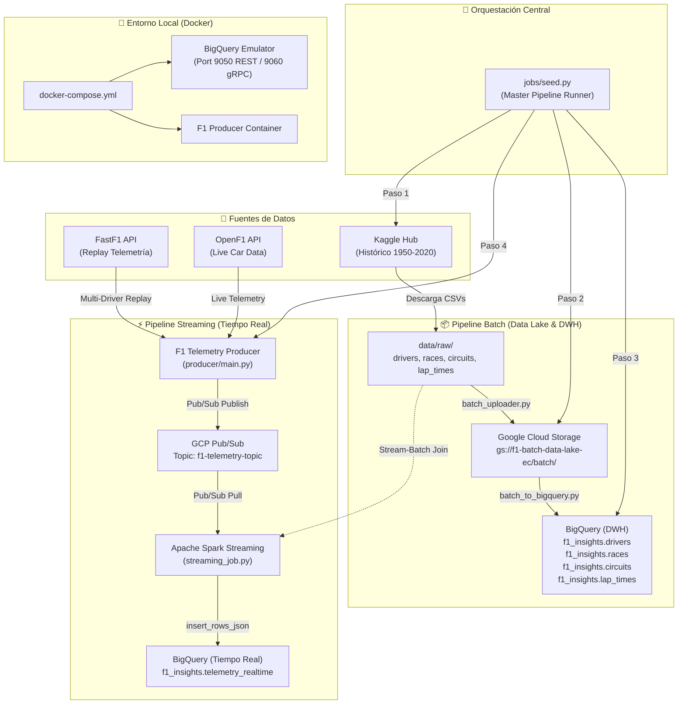

# 🏎️ F1 Telemetry Real-Time & Batch Pipeline

Pipeline de datos end-to-end de alta disponibilidad para la ingesta, procesamiento y almacenamiento de telemetría de **Fórmula 1**, combinando procesamiento **Batch** (Kaggle Data Lake) y **Streaming en tiempo real** (FastF1 / OpenF1 -> Pub/Sub -> Apache Spark -> BigQuery).

---

## 🏛️ Arquitectura del Sistema



---

## 📂 Estructura del Proyecto

```text
f1-telemetry-pipeline/
├── config/
│   └── settings.py              # Centralización de configuración y variables de entorno
├── data/
│   ├── batch_uploader.py        # Ingesta Kaggle -> Local -> GCS
│   ├── batch_to_bigquery.py     # ETL Batch GCS -> BigQuery con limpieza y tipado
│   └── raw/                     # Almacenamiento local de CSVs y caché de FastF1
├── docker/
│   └── producer.Dockerfile      # Imagen Docker para el productor de telemetría
├── jobs/
│   └── seed.py                  # Orquestador maestro del pipeline completo
├── producer/
│   ├── main.py                  # Productor de telemetría multi-piloto y multi-escudería
│   └── requirements.txt         # Dependencias específicas del productor
├── spark_pipeline/
│   └── streaming_job.py         # Procesador Spark Streaming (Pub/Sub + Join + BQ)
├── docker-compose.yml           # Stack local con emulador de BigQuery y productor
├── requirements.txt             # Dependencias completas del proyecto
└── README.md                    # Documentación del proyecto
```

---

## 🚀 Componentes Principales

### 1. Orquestador Maestro (`jobs/seed.py`)
Ejecuta de manera secuencial y automatizada las cuatro fases del pipeline con una sola instrucción:

```powershell
python jobs/seed.py
```

- **Paso 1 (Ingesta Batch Kaggle)**: Descarga el dataset histórico de Formula 1 mediante `kagglehub` y filtra los archivos clave (`drivers.csv`, `races.csv`, `circuits.csv`, `lap_times.csv`) en `data/raw/`.
- **Paso 2 (Data Lake GCS)**: Sube los archivos limpios al bucket `gs://<GCS_BUCKET_NAME>/batch/`.
- **Paso 3 (ETL Batch a BigQuery)**: Procesa nulos (`\N`), convierte fechas (`dob`, `date`), números enteros (`number`, `alt`, `milliseconds`) y consolida las tablas en el dataset `f1_insights` de BigQuery con `WRITE_TRUNCATE`.
- **Paso 4 (Streaming en Tiempo Real)**: Carga la carrera especificada (ej. Monza 2023), detecta automáticamente a **todos los 20 pilotos de todas las escuderías** (Ferrari, Red Bull, Mercedes, McLaren, Aston Martin, Alpine, etc.), sincroniza sus telemetrías cronológicamente e inicia la transmisión continua simulando una transmisión en vivo.

### 2. Productor de Telemetría (`producer/main.py`)
- **Modo Replay**: Extrae la telemetría de vueltas desde FastF1 e intercala las lecturas de velocidad (`speed_kmh`), revoluciones (`rpm`), marcha (`gear`), acelerador (`throttle`), freno (`brake`) y coordenadas (`x_pos`, `y_pos`) en estricto orden cronológico (`timestamp`).
- **Modo Live**: Consume lecturas en tiempo real desde la API de OpenF1.
- **Soporte Dry-Run**: Permite validar la emisión y mapeo de pilotos sin conexión a GCP (`--dry-run`).

### 3. Procesador Streaming Spark (`spark_pipeline/streaming_job.py`)
- Escucha activamente la suscripción `f1-telemetry-topic-sub` en GCP Pub/Sub.
- Realiza un **Stream-Batch Join** enriqueciendo los eventos en tiempo real con el dataset de pilotos (`drivers.csv`) para adjuntar nombre, apellido y nacionalidad.
- Inserta los lotes enriquecidos de forma transaccional en `f1_insights.telemetry_realtime` en BigQuery vía `insert_rows_json`.

### 4. Dashboard de Telemetría en Tiempo Real (`dashboard/`)
- **Frontend F1 Dark Cockpit**:
  - **Mapa 2D de Pista Interactivo (Canvas)**: Renderiza las coordenadas X/Y de todos los monoplazas en pista con colores de cada escudería y halo de glow para el piloto enfocado.
  - **Tacómetro & Shift Lights**: Luces LED de cambio progresivas (verdes, rojas, púrpuras) con limitador de revoluciones a 12,500 RPM.
  - **Velocímetro & Indicador de Marcha**: Display digital de velocidad (0–360 km/h) e indicador de marcha engranada (1–8 / N / R).
  - **Pedales de Telemetría**: Barras de telemetría de Acelerador (verde neón) y Freno (rojo vivo).
  - **Tabla de Clasificación de la Parrilla**: Vista multi-piloto de telemetría y escuderías en tiempo real.
- **Backend FastAPI & WebSockets (`dashboard/server.py`)**:
  - Transmite eventos en sub-segundo a los clientes conectados a `/ws/telemetry`.
  - Recibe eventos vía webhook HTTP `/api/telemetry/ingest` o consulta periódicamente BigQuery.

### 5. Emulación Local de BigQuery (`docker-compose.yml`)
Levanta un emulador completo de BigQuery (`ghcr.io/goccy/bigquery-emulator`) para desarrollar y probar inserciones y consultas sin consumir recursos en la nube:
- **Puerto HTTP REST**: `9050`
- **Puerto gRPC**: `9060`
- **Dataset predeterminado**: `f1_insights`

- **Puerto HTTP REST**: `9050`
- **Puerto gRPC**: `9060`
- **Dataset predeterminado**: `f1_insights`

---

## 🛠️ Instalación y Configuración

### 1. Clonar el repositorio y crear entorno virtual
```powershell
git clone https://github.com/NicoCarrion02/f1-telemetry-pipeline.git
cd f1-telemetry-pipeline

python -m venv .venv
.\.venv\Scripts\Activate.ps1
pip install -r requirements.txt
```

### 2. Variables de Entorno (`.env`)
Crear un archivo `.env` en la raíz del proyecto con las credenciales y configuración:

```env
GOOGLE_APPLICATION_CREDENTIALS="secrets/gcp-service-account.json"
GCP_PROJECT_ID="f1-telemetry-ec"
PUB_SUB_TOPIC="f1-telemetry-topic"
PUB_SUB_SUBSCRIPTION="f1-telemetry-topic-sub"
GCS_BUCKET_NAME="f1-batch-data-lake-ec"
GCS_DESTINATION_FOLDER="batch/"
BIGQUERY_DATASET="f1_insights"
BIGQUERY_TABLE="telemetry_realtime"

# (Opcional) Si se utiliza el emulador local de BigQuery:
# BIGQUERY_EMULATOR_HOST="http://localhost:9050"
```

---

## 💻 Guía de Ejecución

### Opción A: Orquestación Completa (Recomendado)
```powershell
python jobs/seed.py
```

### Opción B: Ejecución Modular

#### 1. Ingesta Batch a Data Lake (GCS)
```powershell
python data/batch_uploader.py
```

#### 2. ETL Batch a BigQuery
```powershell
python data/batch_to_bigquery.py
```

#### 3. Iniciar Consumidor de Streaming (Spark)
```powershell
python spark_pipeline/streaming_job.py
```

#### 4. Iniciar Productor de Streaming
```powershell
# Simulación de Monza 2023 con todos los pilotos
python producer/main.py --mode replay

# Simulación de pilotos específicos con delay personalizado
python producer/main.py --mode replay --drivers 1,16,44,4 --delay 0.05

# Modo prueba local sin enviar a Pub/Sub
python producer/main.py --mode replay --drivers 16,55 --limit 20 --dry-run
```

#### 5. Iniciar Dashboard de Visualización en Tiempo Real
```powershell
# Iniciar servidor web FastAPI (disponible en http://localhost:8000)
python -m uvicorn dashboard.server:app --port 8000
```


---

## 🐳 Despliegue con Docker Compose

Para levantar el emulador local de BigQuery y el productor de telemetría:

```powershell
# Levantar el emulador local de BigQuery
docker compose up -d bigquery

# Levantar todo el stack
docker compose up -d

# Ver logs del productor
docker compose logs -f f1-producer

# Detener los servicios
docker compose down
```

---

## 📊 Tablas en BigQuery (`f1_insights`)

| Tabla | Tipo | Descripción |
|---|---|---|
| `drivers` | Batch | Información biográfica y deportiva de los pilotos de F1 |
| `races` | Batch | Calendario histórico de Grandes Premios y fechas |
| `circuits` | Batch | Trazados, ubicaciones geográficas y altitudes |
| `lap_times` | Batch | Tiempos de vuelta históricos en milisegundos |
| `telemetry_realtime` | Streaming | Telemetría enriquecida en tiempo real (velocidad, rpm, acelerador, freno, posición X/Y, piloto) |